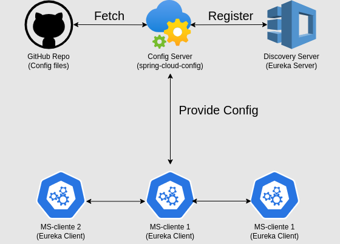

1) Crear proyecto Discovery server.
2) Registrar MS-clientes en el Discovery server.
3) Crear repositorio para los archivos de configuración de los MS-clientes en GitHub.
4) Crear proyecto CONFIG-SERVER para obtener los archivos de configuración de los MS-clientes de GitHub.
5) Conectar MS-clientes al CONFIG-SERVER.
6) Aplicar refresh de configuración en los MS-clientes.
 
___

___

## Configuración Discovery server:
- Dependencias:
  - Eureka server

```
Project: Discovery
File: /src/main/resources/application.properties
_______________________________________________________________________
+ server.port=8761
+ eureka.client.register-with-eureka=false
+ eureka.client.fetch-registry=false
```

```
File: /src/main/java/com/api/Discovery/DiscoveryApplication.java
_______________________________________________________________________
+ @EnableEurekaServer
```
 

## Registrar ms clientes en el discovery server:
- Dependencias:
  - spring-cloud-starter-netflix-eureka-client: Conecta a Eureka server, discovery server.

``` 
Project: Ms-Cliente
File: /src/main/resources/application.properties
_______________________________________________________________________
+ server.port=0
+ spring.application.name={NAME}
+ eureka.instance.instance-id = ${spring.application.name}:${random.uuid}
```

``` 
Project: Ms-Cliente
File: /src/main/java/com/api/Discovery/DiscoveryApplication.java
_______________________________________________________________________
+ @EnableEurekaClient
```

## Configuración centralizada de ms: 
`Spring Cloud Config Server`
 
<mark style="background-color: grey; padding: 5px">Repositorio de configuración centralizada Git 
- Nuevo directorio:
  - Files:
    - apiName-microservice-dev.properties
    - apiName-microservice-prod.properties
    - apiName-microservice-test.properties
  - Data file:
    - apiName.property = apiName profile dev/prod/test
    - Migrar toda la configuración de los ms a este archivo.

<mark style="background-color: grey; padding: 5px">Crear nuevo proyecto `Config-Server` para manejar la configuración centralizada de los ms
- Dependencias:
  - Config Server: Central management for configuration via Git, SVN.
  - Spring Boot Actuator

``` 
Project: Config-Server
File: /src/main/resources/application.properties
_______________________________________________________________________
+ server.port=8888
+ spring.application.name={NAME}
+ spring.cloud.config.server.git.uri=https://github.com/user/repo.git
+ spring.cloud.config.server.git.clone-on-start=true
```


## Conectar ms-cliente al config-server: 
- Dependencias:
  - Spring Cloud Config Client: Para convertir el ms en un cliente de config server.
  - Spring Cloud Starter Bootstrap: Realiza fetch de sus archivos de configuración.

``` 
Project: ms-cliente
File: /src/main/resources/bootstrap.properties
_______________________________________________________________________
+ spring.cloud.config.uri=http://localhost:8888 
```
``` 
Project: ms-cliente
File: /src/main/resources/application.properties
_______________________________________________________________________ 
+ spring.cloud.config.profile=dev
```

## Refresh de configuración:
- Dependencias:
  - Spring Boot Starter Actuator: Para obtener el endpoint de refresh. Este endpoint se debe exponer en el ms-cliente.
  - Spring Cloud Starter Config
  
Migrar configuracion de `/src/main/resources/application.properties` a `/src/main/resources/bootstrap.properties`
Porque se carga primero el bootstrap.properties y luego el application.properties.
 
```
Project: ms-cliente
File: /src/main/resources/bootstrap.properties
_______________________________________________________________________
+ management.endpoints.web.exposure.include=*
```

``` 
Project: ms-cliente
File: controller.java
_______________________________________________________________________
+ @RefreshScope
```
### @RefreshScope 

- Cambiar valores de configuracion y actualizar/reiniciar manualmente en el ms-cliente.
- Se debe agregar en el controlador que va a ser actualizado.
- Al realizar una petición de refresh, se actualiza el valor de la variable.

### <mark style="background-color: red; font-size: 1.2rem; font-weight: bold;" >Desventaja:
- reiniciar el ms-cliente para que se aplique el cambio.

### Se debe realizar petition a POST: `http://localhost:8080/actuator/refresh`

### <mark style="background-color: red; font-size: 1.2rem; font-weight: bold;" >Desventaja:
- realizar la peticion de refresh cada vez que se realice un cambio en la configuracion.

### <mark style="background-color: green; font-size: 1.2rem; font-weight: bold;" >Solucion:
- Agregar arquitectura de mensajeria para que el ms-cliente sepa cuando se realizo un cambio en la configuracion.
- Se debe agregar un nuevo proyecto `Config-Server-Bus` para manejar la configuracion centralizada de los ms.
- Solucion en archivo `message_broker.md`

## Proximo paso centralizar configuracion en un cliente externo para mas seguridad

- Ejemplo: hashicorp vault

