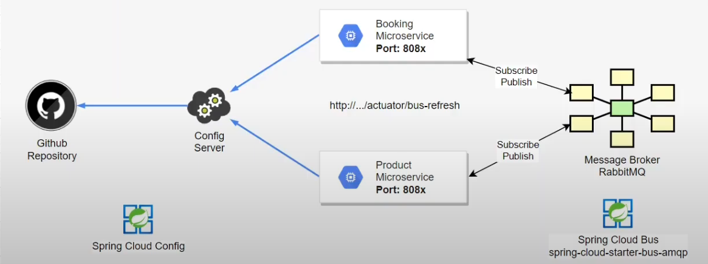

___

___

## MS-Clients
- Dependencias:
  - Spring Boot Starter Bus Amqp: Para conectarse al broker. 


## Instalar rabbitmq o kafka

## Configurar rabbitmq

``` 
Project: ms-cliente
File: /src/main/resources/bootstrap.properties
_______________________________________________________________________
+ spring.rabbitmq.host=localhost
+ spring.rabbitmq.port=5672
+ spring.rabbitmq.username=guest
+ spring.rabbitmq.password=guest
```

## Prueba de actualización de configuración desde rabbitmq

1) Modificar archivo de configuración en el repositorio de configuración centralizada.
2) Para realizar actualizacion global de configuración:
  - curl -X POST http://localhost:8888/actuator/busrefresh