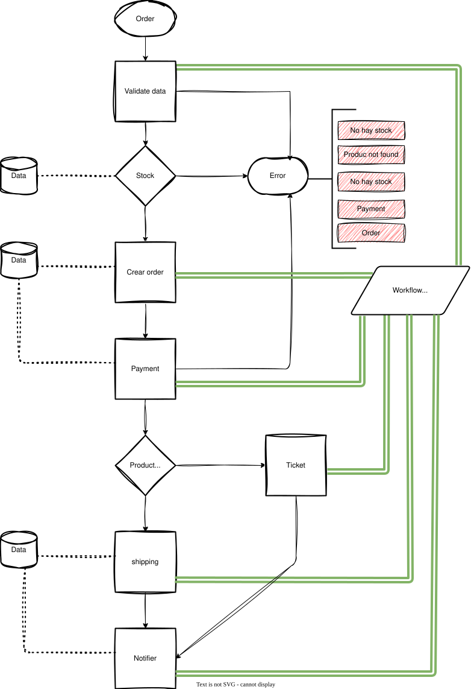

## Introducción

Idea Principales: Ecommerce, arquitectura de microservicios, basada en eventos y mensajería asíncrona.
Los productos y servicios del Front se alimentan del cache(Redis).
Cache(Redis) obtiene los datos realeas y actualizado de la base de datos principal como fuente de la verdad.
Base de datos principal se cargan los registros desde las apiRest CRUD.

## Requerimientos Tecnicos:

- Gateway API : Autenticacion, Autorizacion, Monitoreo, Cors, Logs.
- Redis: Cache.
- Rabbit: message queue, pub/sub, message broker.
- Integracion de pagos, Integracion de correo electronico, Integracion de notificaciones.
- Integracion de envio de productos, Integracion de almacenamiento de archivos.

## Flujo de trabajo:

1. Usuario realiza una orden de compra.
   - Verificación de datos del usuario y productos seleccionados.
   - Creacion de la orden de compra.
     - Estado orden pendiente.
     - Estado pago pendiente.
2. Message Queue.
   - Sistema verifica la disponibilidad de los productos y servicios.
   - - Verifica y bloquea items en Redis.
   - - Valida items en base de datos principal.
   - - Actualiza la base de datos principal.
   - - Libera los items en Redis.
   - - Actualiza los items en Redis.
3. Message Queue.
   - Sistema de mercado de pago.
     - Se crea un link de pago.
     - Se envia el link de pago al registro de la orden de compra en DB.
4. Usuario espera el link de pago.
   - Sistema notifica al usuario sobre el link de pago.
   - Usuario realiza el pago.
     - Se envia al usuario pagina principal.
   - Web Hook: Se realizo una compra.
     - Se obtiene el dato de la compra.
     - Se obtiene el dato de la orden a traves de la compra.
       - Actualizacion de la orden de compra.
         - Estado orden pendiente.
         - Estado pago realizado.
5. Event queue.
   - Se publica el evento de pago realizado.
     - Se notifica al usuario del pedido en proceso.
     - Se notifica al deposito de productos.

Extras:

- Servicios de citas/turnos:
  - Generar turnos.
  - Agendar citas.
  - Cancelar citas.
  - Tickets codigo de barras email.
  - Integracion con whatsapp.

## Boceto 1

## Lecturas

- **ARQUITECTURA DE SOFTWARE - Conceptos y ciclo de desarrollo**
  `Humberto Cervantes Maceda, Perla Velasco-Elizondo, Luis Castro Careaga`
